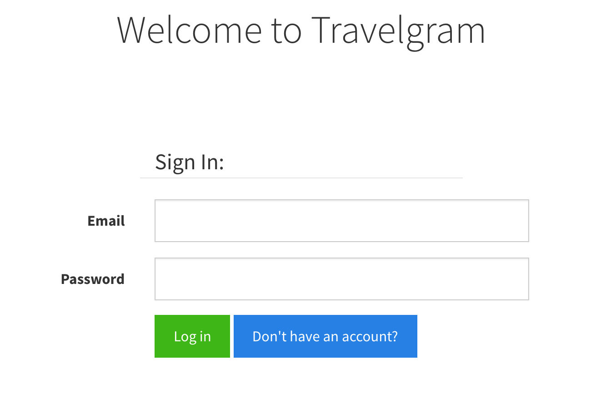
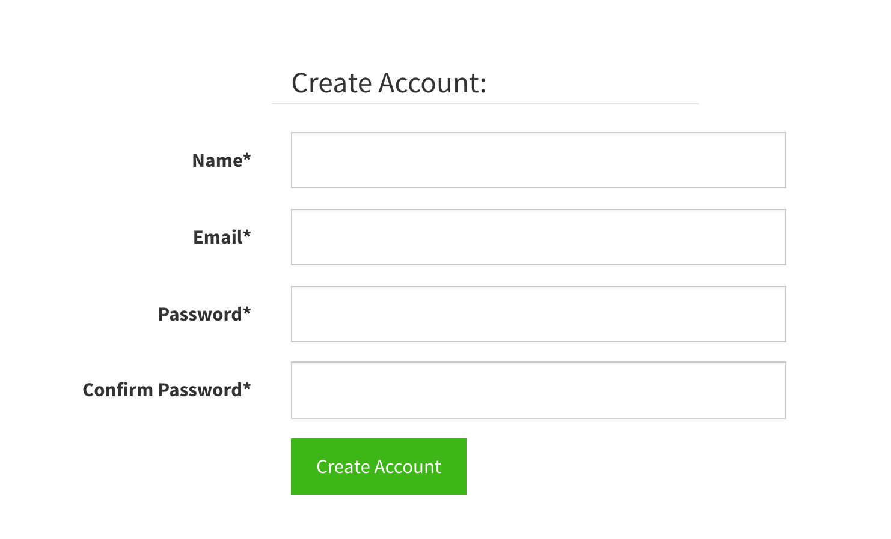
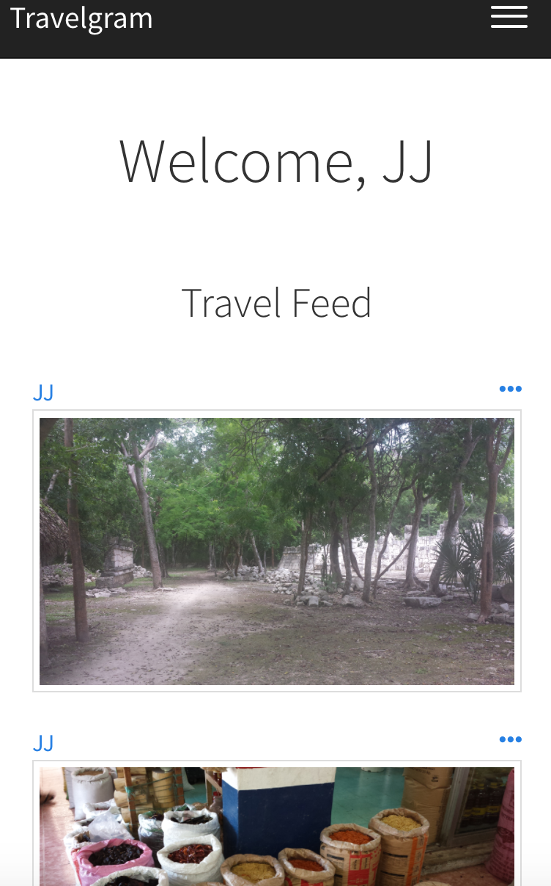
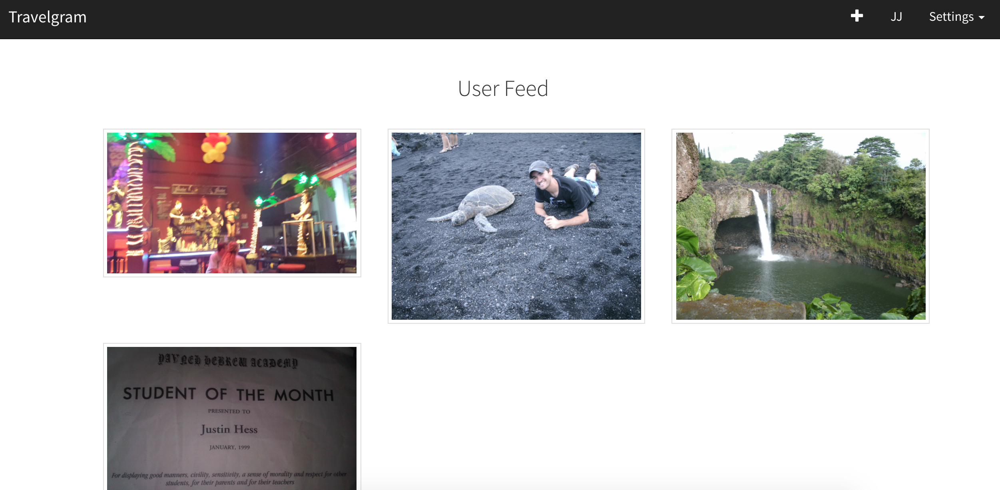

#Travelgram

<https://immense-oasis-47035.herokuapp.com>

###User Stories

When User enters the app he is routed to Login page:

Login - If User logs in successfully routed to Posts page. Otherwise he needs to create an account.

Create Account - Once user creates account he is routed to Posts page.

Posts - This page contains all Posts from every user. A post contains image, title, content and user id. Each Post is clickable and takes you to the Post Show page. Clicking on a user's name will take you to the specific User show page.

User Show - This page displays all Posts from that specific User.

NavBar - The NavBar contains the current User name, add a Post, route to home page.

ToDo:
1. Add Comments
2. More Bootstrap

###WireFrames

In progress...

This README would normally document whatever steps are necessary to get the
application up and running.

Things you may want to cover:

* Ruby version

* System dependencies

* Configuration

* Database creation

* Database initialization

* How to run the test suite

* Services (job queues, cache servers, search engines, etc.)

* Deployment instructions

* ...

Please feel free to use a different markup language if you do not plan to run
<tt>rake doc:app</tt>.
